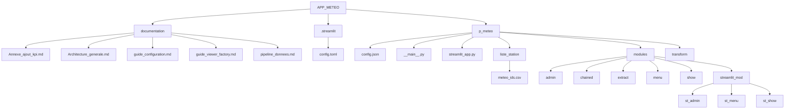

# 🌦️ Application Météo – Version Console & Version Web

Ce projet a été réalisé dans le cadre de ma formation en développement Python.  
L’objectif était de créer une application météo complète, capable de fonctionner :

- en **version console** (interface texte)  
- en **version web** grâce à **Streamlit**

L’application permet de consulter les données météo de différentes villes, d’administrer une liste de stations, et d’afficher plusieurs indicateurs (température, humidité, vent…).

---

## 🎯 Objectifs pédagogiques

- Manipuler des fichiers CSV et des DataFrame (Pandas)  
- Structurer un projet Python de manière modulaire  
- Créer une interface console interactive  
- Créer une interface web moderne avec Streamlit  
- Appeler une API externe pour récupérer des données météo  
- Gérer un mode administrateur (ajout, modification, suppression de stations)  
- Produire une documentation claire et exploitable

---

## 🧱 Fonctionnalités principales

### ✔ Version console

- Menu principal interactif  
- Consultation météo d’une ville  
- Affichage des KPI météo  
- Mode administrateur :  
  - Ajouter une station  
  - Modifier une station  
  - Supprimer une station  
  - Test API intégré

### ✔ Version web (Streamlit)

- Interface moderne et intuitive  
- Navigation par onglets  
- Affichage des données météo en temps réel  
- Mode administrateur complet :  
  - Ajout / modification / suppression de stations  
  - Formulaire dynamique  
  - Test API optionnel  
  - Messages de validation persistants  
  - Réinitialisation automatique des formulaires

---

## 📁 Structure du projet

APP_METEO/
├── .env
├── .gitignore
├── README.md
├── requirements.txt
│
├── documentation/
│   ├── Annexe_ajout_kpi.md
│   ├── Architecture_generale.md
│   ├── guide_configuration.md
│   ├── guide_viewer_factory.md
│   └── pipeline_donnees.md
│
├── .streamlit/
│   └── config.toml
│
└── p_meteo/
    ├── config.json
    ├── __main__.py
    ├── streamlit_app.py
    │
    ├── liste_station/
    │   └── meteo_ids.csv
    │
    ├── modules/
    │   ├── admin/
    │   │   ├── station_admin.py
    │   │   └── station_form.py
    │   │
    │   ├── chained/
    │   │   └── linked_list.py
    │   │
    │   ├── extract/
    │   │   ├── call_api.py
    │   │   ├── station_selector.py
    │   │   └── to_dataframe.py
    │   │
    │   ├── menu/
    │   │   ├── admin_menu.py
    │   │   ├── kpi_menu.py
    │   │   └── main_menu.py
    │   │
    │   ├── show/
    │   │   ├── build_viewer_list.py
    │   │   ├── s_direction_vent_max_deg.py
    │   │   ├── s_direction_vent_max.py
    │   │   ├── s_direction_vent_moyen.py
    │   │   ├── s_heure_maj.py
    │   │   ├── s_humidite.py
    │   │   ├── s_pluie_max.py
    │   │   ├── s_pluie.py
    │   │   ├── s_pression.py
    │   │   ├── s_rafale_max.py
    │   │   ├── s_temperature.py
    │   │   ├── s_vent_moyen.py
    │   │   └── s_ville.py
    │   │
    │   └── streamlit_mod/
    │       ├── st_viewer_factory.py
    │       │
    │       ├── st_admin/
    │       │   ├── st_station_admin.py
    │       │   └── st_station_form.py
    │       │
    │       ├── st_menu/
    │       │   ├── admin_menu.py
    │       │   ├── kpi_menu.py
    │       │   ├── main_menu.py
    │       │   ├── menu_boutton.py
    │       │   └── weather_menu.py
    │       │
    │       └── st_show/
    │           ├── st_build_viewer_list.py
    │           ├── st_direction_vent_max_deg.py
    │           ├── st_direction_vent_max.py
    │           ├── st_direction_vent_moyen.py
    │           ├── st_heure_maj.py
    │           ├── st_humidite.py
    │           ├── st_pluie_max.py
    │           ├── st_pluie.py
    │           ├── st_pression.py
    │           ├── st_rafale_max.py
    │           ├── st_temperature.py
    │           ├── st_vent_moyen.py
    │           └── st_ville.py     
    │
    └── transform/
        ├── record.py
        ├── t_direction_vent_max_deg.py
        ├── t_direction_vent_max.py
        ├── t_direction_vent_moyen.py
        ├── t_heure_maj.py
        ├── t_humidite.py
        ├── t_pluie_max.py
        ├── t_pluie.py
        ├── t_pression.py
        ├── t_rafale_max.py
        ├── t_temperature.py
        ├── t_vent_moyen.py
        └── t_ville.py

