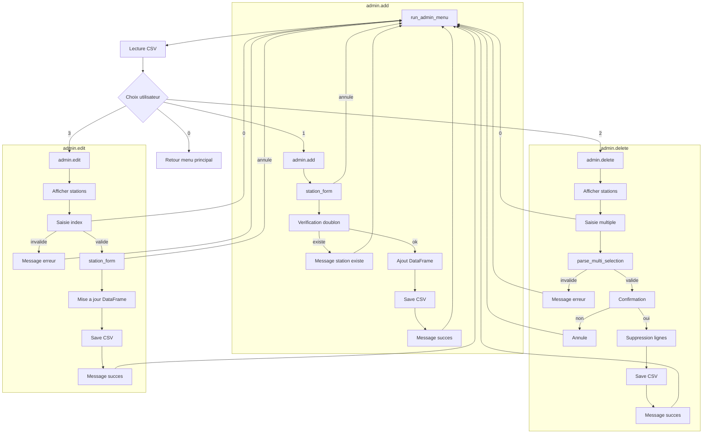

```mermaid
flowchart TD

    %% ENTREE DANS LE MODE ADMIN
    A[run_admin_menu] --> B[Lecture CSV]
    B --> C{Choix utilisateur}

    C -->|1| D[admin.add]
    C -->|2| E[admin.delete]
    C -->|3| F[admin.edit]
    C -->|0| X[Retour menu principal]

    %% AJOUT
    subgraph AJOUT [admin.add]
        D --> D1[station_form]
        D1 -->|annule| A
        D1 --> D2[Verification doublon]
        D2 -->|existe| D3[Message station existe]
        D3 --> A
        D2 -->|ok| D4[Ajout DataFrame]
        D4 --> D5[Save CSV]
        D5 --> D6[Message succes]
        D6 --> A
    end

    %% SUPPRESSION
    subgraph SUPPRESSION [admin.delete]
        E --> E1[Afficher stations]
        E1 --> E2[Saisie multiple]
        E2 -->|0| A
        E2 --> E3[parse_multi_selection]
        E3 -->|invalide| E4[Message erreur]
        E4 --> A
        E3 -->|valide| E5[Confirmation]
        E5 -->|non| E6[Annule]
        E6 --> A
        E5 -->|oui| E7[Suppression lignes]
        E7 --> E8[Save CSV]
        E8 --> E9[Message succes]
        E9 --> A
    end

    %% MODIFICATION
    subgraph MODIFICATION [admin.edit]
        F --> F1[Afficher stations]
        F1 --> F2[Saisie index]
        F2 -->|0| A
        F2 -->|invalide| F3[Message erreur]
        F3 --> A
        F2 -->|valide| F4[station_form]
        F4 -->|annule| A
        F4 --> F5[Mise a jour DataFrame]
        F5 --> F6[Save CSV]
        F6 --> F7[Message succes]
        F7 --> A
    end
```
