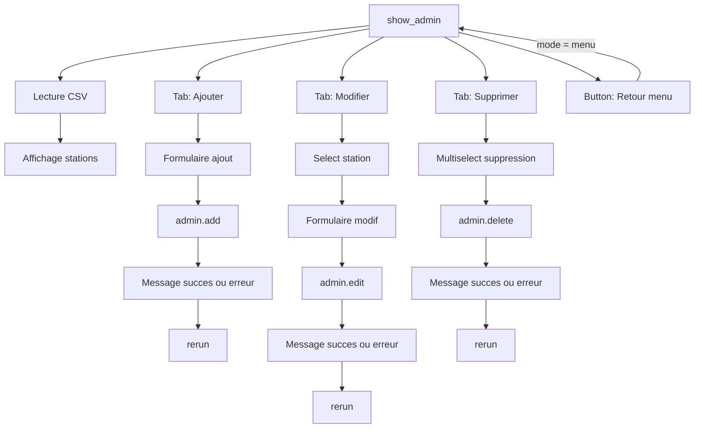

```mermaid
flowchart TD

    A[show_admin] --> B[Lecture CSV]
    B --> C[Affichage stations]

    %% ONGLET AJOUT
    A --> D[Tab: Ajouter]
    D --> D1[Formulaire ajout]
    D1 --> D2[admin.add]
    D2 --> D3[Message succes ou erreur]
    D3 --> D4[rerun]

    %% ONGLET MODIFIER
    A --> E[Tab: Modifier]
    E --> E1[Select station]
    E1 --> E2[Formulaire modif]
    E2 --> E3[admin.edit]
    E3 --> E4[Message succes ou erreur]
    E4 --> E5[rerun]

    %% ONGLET SUPPRIMER
    A --> F[Tab: Supprimer]
    F --> F1[Multiselect suppression]
    F1 --> F2[admin.delete]
    F2 --> F3[Message succes ou erreur]
    F3 --> F4[rerun]

    %% RETOUR MENU
    A --> G[Button: Retour menu]
    G -->|mode = menu| A
```
