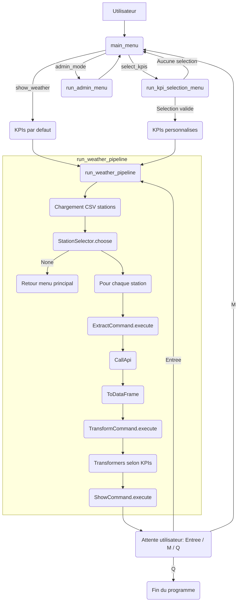

```mermaid
flowchart TD

U[Utilisateur] --> M(main_menu)

M -->|show_weather| DEF(KPIs par defaut)
M -->|select_kpis| SK(run_kpi_selection_menu)
M -->|admin_mode| ADM(run_admin_menu)

SK -->|Selection valide| SETKPI(KPIs personnalises)
SK -->|Aucune selection| M

DEF --> PIPE(run_weather_pipeline)
SETKPI --> PIPE
ADM --> M

subgraph PIPELINE [run_weather_pipeline]
    PIPE --> CSV(Chargement CSV stations)
    CSV --> SEL(StationSelector.choose)
    SEL -->|None| RETMENU(Retour menu principal)
    SEL --> LOOP(Pour chaque station)
    LOOP --> EX(ExtractCommand.execute)
    EX --> API(CallApi)
    API --> DF(ToDataFrame)
    DF --> TR(TransformCommand.execute)
    TR --> TF(Transformers selon KPIs)
    TF --> SH(ShowCommand.execute)
end

SH --> ASK("Attente utilisateur: Entree / M / Q")
ASK -->|Entree| PIPE
ASK -->|M| M
ASK -->|Q| END(Fin du programme)
```
