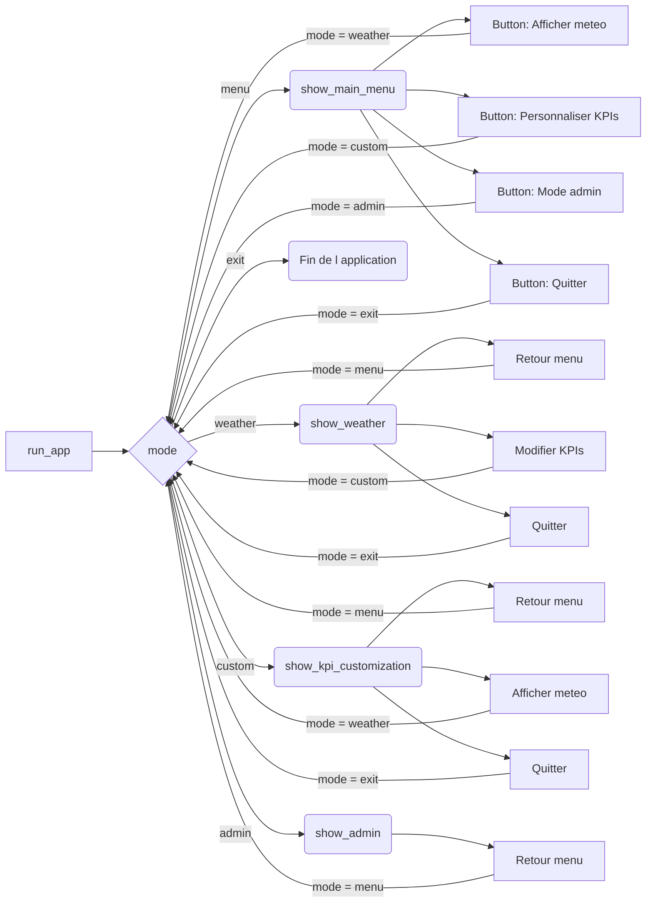

```mermaid
flowchart LR

    A[run_app] --> B{mode}

    B -->|menu| M(show_main_menu)
    B -->|weather| W(show_weather)
    B -->|custom| C(show_kpi_customization)
    B -->|admin| AD(show_admin)
    B -->|exit| X(Fin de l application)

    %% MENU
    M --> M1[Button: Afficher meteo]
    M --> M2[Button: Personnaliser KPIs]
    M --> M3[Button: Mode admin]
    M --> M4[Button: Quitter]

    M1 -->|mode = weather| B
    M2 -->|mode = custom| B
    M3 -->|mode = admin| B
    M4 -->|mode = exit| B

    %% WEATHER
    W --> W1[Retour menu]
    W --> W2[Modifier KPIs]
    W --> W3[Quitter]

    W1 -->|mode = menu| B
    W2 -->|mode = custom| B
    W3 -->|mode = exit| B

    %% CUSTOM
    C --> C1[Retour menu]
    C --> C2[Afficher meteo]
    C --> C3[Quitter]

    C1 -->|mode = menu| B
    C2 -->|mode = weather| B
    C3 -->|mode = exit| B

    %% ADMIN
    AD --> A1[Retour menu]
    A1 -->|mode = menu| B
```