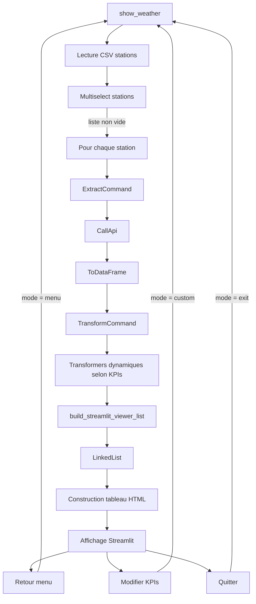

```mermaid
flowchart TD

    %% SELECTION STATIONS
    A[show_weather] --> B[Lecture CSV stations]
    B --> C[Multiselect stations]
    C -->|liste non vide| D[Pour chaque station]

    %% EXTRACTION
    D --> E[ExtractCommand]
    E --> F[CallApi]
    F --> G[ToDataFrame]

    %% TRANSFORMATION
    G --> H[TransformCommand]
    H --> I[Transformers dynamiques selon KPIs]

    %% VIEWERS
    I --> J[build_streamlit_viewer_list]
    J --> K[LinkedList]

    %% AFFICHAGE
    K --> L[Construction tableau HTML]
    L --> M[Affichage Streamlit]

    %% NAVIGATION
    M --> N[Retour menu]
    M --> O[Modifier KPIs]
    M --> P[Quitter]

    N -->|mode = menu| A
    O -->|mode = custom| A
    P -->|mode = exit| A
```
