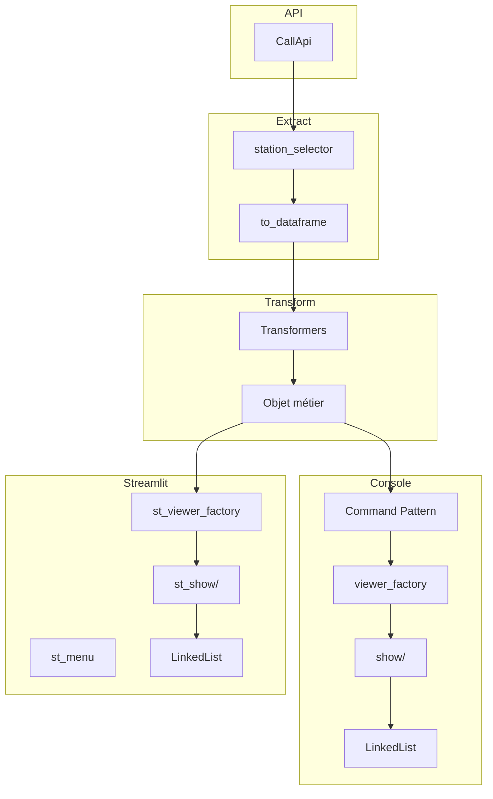

# 🏗️ Architecture générale du projet APP_METEO

Ce document présente la **vue d’ensemble** de l’architecture du projet APP_METEO.  
Il décrit les grands blocs fonctionnels, les interactions entre modules, les patterns utilisés et les pipelines de traitement.  
Les détails internes (fichiers, classes, logique métier) sont documentés dans le dossier `10_Modules/`.

---

# 📚 1. Vue d’ensemble

L’application APP_METEO repose sur une architecture modulaire organisée autour de trois grands axes :

- **Extraction des données** : communication avec l’API météo, récupération des données brutes et conversion en DataFrame.
- **Transformation des données** : application de transformations pour produire des indicateurs météo (KPI).
- **Affichage** : rendu des KPI en version console ou en version web (Streamlit).

Deux interfaces coexistent :

- une **interface console**, structurée autour du *Command Pattern*  
- une **interface Streamlit**, pilotée par l’interface utilisateur

---

# 🗂️ 2. Structure générale du projet

```
APP_METEO/
├── documentation/
├── .streamlit/
└── p_meteo/
    ├── config.json
    ├── __main__.py
    ├── streamlit_app.py
    ├── liste_station/
    ├── modules/
    ├── transform/
    └── utils/
```

---

## 2.1 Points d’entrée de l’application

L’application peut être lancée via deux interfaces distinctes :

### Interface console
- Point d’entrée : `p_meteo/__main__.py`
- Rôle :
  - afficher le menu principal  
  - gérer la sélection des KPI  
  - orchestrer la boucle utilisateur  
  - déclencher le pipeline météo (Extract → Transform → Show)

### Interface Streamlit
- Point d’entrée : `p_meteo/streamlit_app.py`
- Rôle :
  - initialiser la configuration  
  - gérer la navigation via `st.session_state`  
  - déclencher le pipeline météo depuis l’interface web

---

# 🧩 3. Description des grands modules

## 3.1 `modules/`
Dossier principal contenant la logique métier de l’application.

Il regroupe plusieurs sous‑modules :

- `command/` : pipeline console (Command Pattern)  
- `configuration/` : singleton de configuration  
- `extract/` : accès aux données météo  
- `transform/` : transformations KPI  
- `show/` : affichage console  
- `menu/` : menus console  
- `admin/` : gestion des stations (console)  
- `streamlit_mod/` : interface Streamlit  
- `chained/` : implémentation d’une LinkedList
- `utils/` : Utilitaires console (gestion des entrées, parsing, helpers d’affichage)

## 3.2 `liste_station/`
Données des stations météo :
- fichier CSV listant les `dataset_id` et les villes associées

---

# 🔌 4. Pipeline console (Command Pattern)

Le pipeline console est structuré en trois étapes successives :

```
ExtractCommand  →  TransformCommand  →  ShowCommand
```

### 1. Extraction
- appel API  
- récupération des données brutes  
- conversion en DataFrame

### 2. Transformation
- application des transformers  
- enrichissement d’un objet métier

### 3. Affichage
- construction d’une LinkedList de viewers console  
- affichage séquentiel des KPI

---

# 🌐 5. Pipeline Streamlit (UI‑driven)

La version Streamlit ne repose pas sur le *Command Pattern*.  
Le pipeline est déclenché directement par l’interface utilisateur.

### Étapes :

1. Sélection des stations  
2. Extraction via `ExtractCommand`  
3. Transformation via `TransformCommand`  
4. Construction d’une LinkedList de viewers Streamlit  
5. Affichage via widgets Streamlit ou tableau HTML

---

# 🧱 6. Patterns utilisés

## 6.1 Command Pattern
Utilisé dans la version console pour structurer le pipeline :
- `ExtractCommand`  
- `TransformCommand`  
- `ShowCommand`

## 6.2 Factory Pattern
Deux factories :
- `viewer_factory.py` (console)  
- `st_viewer_factory.py` (Streamlit)

## 6.3 Singleton Pattern
`Configuration` :
- chargement unique de `config.json`  
- accès centralisé aux mappings et paramètres

## 6.4 Linked List Pattern
Implémentée dans `chained/linked_list.py` :
- structure séquentielle de viewers  
- utilisée en console et en Streamlit

## 6.5 Modularisation par dossier
Chaque dossier représente un domaine fonctionnel :
- extraction  
- transformation  
- affichage  
- menus  
- administration  
- utilitaires

---

# 🧭 7. Schéma global (Mermaid)



---

# 📘 8. Conclusion

L’architecture d’APP_METEO repose sur :

- une séparation claire des responsabilités  
- des patterns structurants (Command, Factory, Singleton, LinkedList)  
- deux pipelines distincts (console et Streamlit)  
- une modularisation forte par dossier

Ce document fournit la vue d’ensemble.  
Les détails techniques sont décrits dans le dossier `10_Modules/`.
