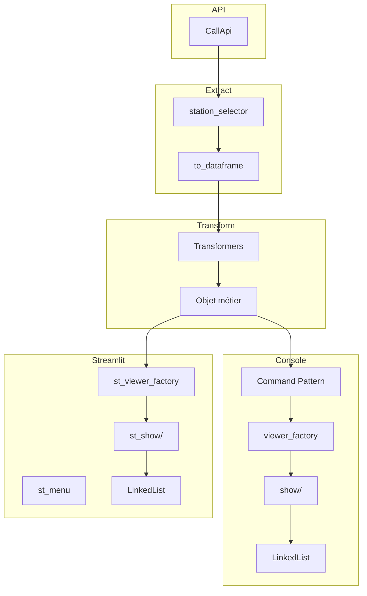

# 🏗️ Architecture générale du projet APP_METEO

Ce document présente la **vue d’ensemble** de l’architecture du projet APP_METEO.  
Il décrit les grands blocs fonctionnels, les interactions entre modules, les patterns utilisés et les pipelines de traitement.  
Les détails internes (fichiers, classes, logique métier) sont documentés dans le dossier `10_Modules/`.

---

# 📚 1. Vue d’ensemble

L’application APP_METEO repose sur une architecture modulaire organisée autour de trois grands axes :

- **Extraction des données** : communication avec l’API météo, récupération des données brutes et conversion en DataFrame.
- **Transformation des données** : application de transformations pour produire des indicateurs météo (KPI).
- **Affichage** : rendu des KPI en version console ou en version web (Streamlit).

Deux interfaces coexistent :

- une **interface console**, structurée autour du *Command Pattern*  
- une **interface Streamlit**, pilotée par l’interface utilisateur

---

# 🗂️ 2. Structure générale du projet

```
APP_METEO/
├── documentation/
├── .streamlit/
└── p_meteo/
    ├── config.json
    ├── streamlit_app.py
    ├── liste_station/
    ├── modules/
    ├── transform/
    └── utils/
```

Chaque dossier correspond à un domaine fonctionnel clairement séparé.

---

# 🧩 3. Description des grands modules

## 3.1 `modules/`
Dossier principal contenant la logique métier de l’application.

Il regroupe plusieurs sous‑modules :

### **a) `command/`**
Pipeline console basé sur le *Command Pattern* :
- extraction  
- transformation  
- affichage console  

### **b) `configuration/`**
Gestion centralisée de la configuration via un **Singleton** :
- mappings KPI  
- mappings viewers  
- paramètres généraux  
- KPIs sélectionnés  

### **c) `extract/`**
Couche d’accès aux données :
- appel API  
- sélection de station  
- conversion en DataFrame  

### **d) `transform/`**
Application des transformations pour produire les KPI :
- un transformer par indicateur  
- enrichissement d’un objet métier  

### **e) `show/` (console)**
Affichage textuel des KPI :
- construction d’une liste chaînée de viewers  
- rendu console  

### **f) `menu/` (console)**
Menus textuels :
- menu principal  
- menu KPI  
- menu administrateur  

### **g) `admin/` (console)**
Gestion des stations météo :
- ajout  
- modification  
- suppression  

### **h) `streamlit_mod/`**
Modules dédiés à l’interface Streamlit :
- menus web  
- affichage web  
- factory Streamlit  
- gestion admin web  

### **i) `chained/`**
Implémentation d’une **LinkedList** utilisée pour l’affichage séquentiel des KPI.

---

## 3.2 `transform/`
Dossier contenant les transformations métier :
- un fichier par KPI  
- enrichissement d’un objet métier  
- logique indépendante de l’affichage  

---

## 3.3 `utils/`
Fonctions utilitaires pour la console :
- gestion des entrées  
- parsing  
- sécurisation des choix  
- helpers d’affichage  

---

## 3.4 `liste_station/`
Contient les données des stations météo :
- fichier CSV listant les `dataset_id` et les villes associées  

---

# 🔌 4. Pipeline console (Command Pattern)

Le pipeline console est structuré en trois étapes successives :

```
ExtractCommand  →  TransformCommand  →  ShowCommand
```

### **1. Extraction**
- appel API  
- récupération des données brutes  
- conversion en DataFrame  

### **2. Transformation**
- application des transformers  
- enrichissement d’un objet métier  

### **3. Affichage**
- construction d’une LinkedList de viewers console  
- affichage séquentiel des KPI  

Ce pipeline est entièrement encapsulé dans le *Command Pattern*.

---

# 🌐 5. Pipeline Streamlit (UI‑driven)

La version Streamlit ne repose pas sur le *Command Pattern*.  
Le pipeline est déclenché directement par l’interface utilisateur.

### Étapes :

1. Sélection des stations  
2. Extraction via `ExtractCommand`  
3. Transformation via `TransformCommand`  
4. Construction d’une LinkedList de viewers Streamlit  
5. Affichage via widgets Streamlit ou tableau HTML  

La navigation est gérée par `st_menu/`.

---

# 🧱 6. Patterns utilisés

## 6.1 Command Pattern
Utilisé exclusivement dans la version console pour structurer le pipeline :

- `ExtractCommand`  
- `TransformCommand`  
- `ShowCommand`  

Permet une séparation claire des étapes.

---

## 6.2 Factory Pattern
Deux factories distinctes :

- `viewer_factory.py` (console)  
- `st_viewer_factory.py` (Streamlit)  

Elles créent dynamiquement les viewers à partir d’un nom technique de KPI.

---

## 6.3 Singleton Pattern
`Configuration` est un singleton chargé de :

- charger `config.json`  
- fournir les mappings KPI  
- fournir les mappings viewers  
- gérer les KPIs sélectionnés  

---

## 6.4 Linked List Pattern
Implémentée dans `chained/linked_list.py` :

- structure séquentielle de viewers  
- utilisée en console et en Streamlit  
- permet un affichage ordonné et extensible  

---

## 6.5 Modularisation par dossier
Chaque dossier représente un domaine fonctionnel :

- extraction  
- transformation  
- affichage console  
- affichage Streamlit  
- menus  
- administration  
- utilitaires  

Cette organisation garantit une séparation claire des responsabilités.

---

# 🧭 7. Schéma global (Mermaid)



---

# 📘 8. Conclusion

L’architecture d’APP_METEO repose sur :

- une séparation claire des responsabilités  
- des patterns structurants (Command, Factory, Singleton, LinkedList)  
- deux pipelines distincts (console et Streamlit)  
- une modularisation forte par dossier  

Ce document fournit la vue d’ensemble.  
Les détails techniques sont décrits dans le dossier `10_Modules/`.

