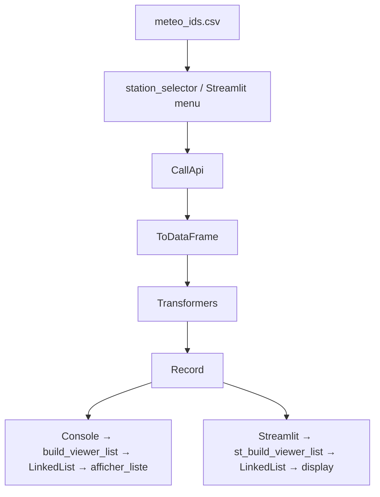

# 🔄 Pipeline de traitement des données météo

Ce document décrit le **flux complet de traitement des données** dans l’application APP_METEO, depuis la sélection d’une station jusqu’à l’affichage final des KPI, en version console et en version Streamlit.

Il s’agit d’un document transversal : il ne décrit pas les modules individuellement (voir `10_Modules/`), mais **le cheminement des données** à travers l’application.

---

# 🧭 1. Vue d’ensemble du pipeline

Le pipeline suit les étapes suivantes :

1. **Sélection de la station météo** (`dataset_id`)
2. **Appel à l’API** pour récupérer les données brutes
3. **Conversion en DataFrame** Pandas
4. **Application des transformations** pour extraire les KPI
5. **Construction d’un objet métier** enrichi
6. **Affichage des KPI**  
   - en console  
   - ou en Streamlit  

---

# 🛰️ 2. Étape 1 : Sélection de la station

### Source des stations  
- Fichier : `liste_station/meteo_ids.csv`  
- Contenu : `dataset_id`, `ville`

### Utilisation  
- **Console** : via `station_selector`  
- **Streamlit** : via `weather_menu.py` (multiselect)

Cette étape fournit le `dataset_id` nécessaire pour interroger l’API.

---

# 🌐 3. Étape 2 : Appel API

### Module  
`modules/extract/call_api.py`

### Fonctionnement  
- Instanciation : `CallApi(dataset_id)`
- Méthode : `fetch()`
- Résultat : données brutes JSON provenant de l’API météo

Cette étape ne transforme pas les données : elle les récupère telles quelles.

---

# 📊 4. Étape 3 : Conversion en DataFrame

### Module  
`modules/extract/to_dataframe.py`

### Fonctionnement  
- Instanciation : `ToDataFrame(api.data, dataset_id, ville)`
- Méthode : `convert()`
- Résultat : `pandas.DataFrame` propre et exploitable

Cette étape :
- normalise les données brutes  
- ajoute des colonnes utiles (ville, dataset_id, etc.)

---

# 🧪 5. Étape 4 : Transformation des données

### Dossier  
`transform/`

### Fonctionnement  
Chaque fichier `t_*.py` correspond à un KPI (température, humidité, vent, pluie…).

Un transformer :

- reçoit le DataFrame et un objet métier
- extrait ou calcule la valeur du KPI
- enrichit l’objet métier
- retourne l’objet métier mis à jour

Les transformers sont appliqués **séquentiellement**.

---

# 🧠 6. Étape 5 : Construction de l’objet métier

### Fichier  
`transform/record.py`

### Fonctionnement  
- création dynamique d’un attribut par KPI  
- initialisation à `None`  
- enrichissement par les transformers  

L’objet métier final contient **tous les KPI prêts à afficher**.

---

# 🖥️ 7. Étape 6a : Affichage console

### Pipeline console  
- `ShowCommand(record, selected_kpis)`
- `build_viewer_list(record, selected_kpis)`
- création d’une `LinkedList` de viewers console
- affichage séquentiel via `afficher_liste()`

### Viewers console  
`modules/show/s_*.py`

Chaque viewer :
- lit un attribut du Record  
- formate la valeur  
- l’affiche en console

---

# 🌐 8. Étape 6b : Affichage Streamlit

### Pipeline Streamlit  
- déclenché par `weather_menu.py`
- extraction via `ExtractCommand`
- transformation via `TransformCommand`
- construction d’une `LinkedList` via `st_build_viewer_list()`

### Viewers Streamlit  
`modules/streamlit_mod/st_show/st_*.py`

Chaque viewer :
- lit un attribut du Record  
- affiche via `st.metric`, `st.warning`, ou HTML

---

# 🧬 9. Schéma Mermaid du pipeline

